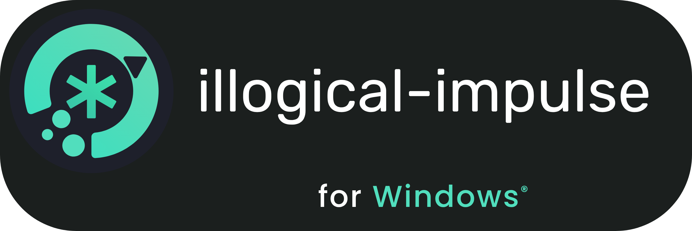
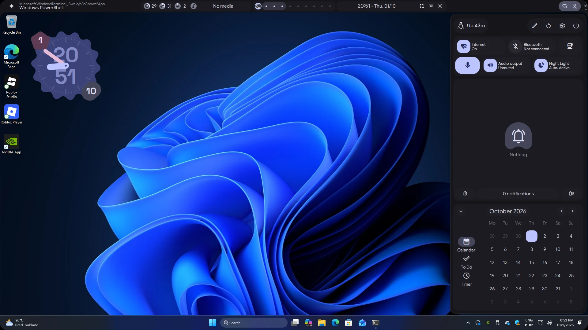
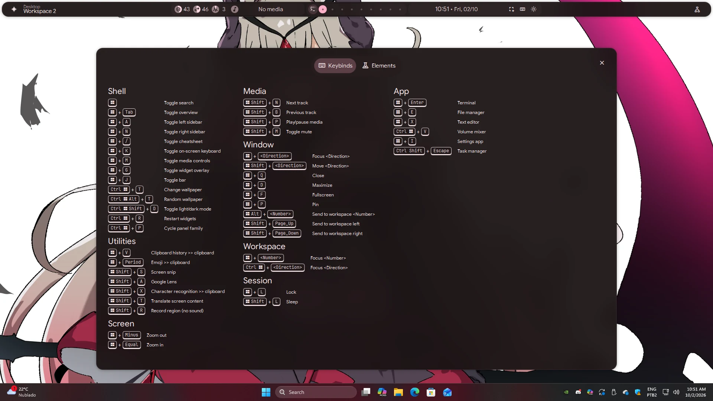
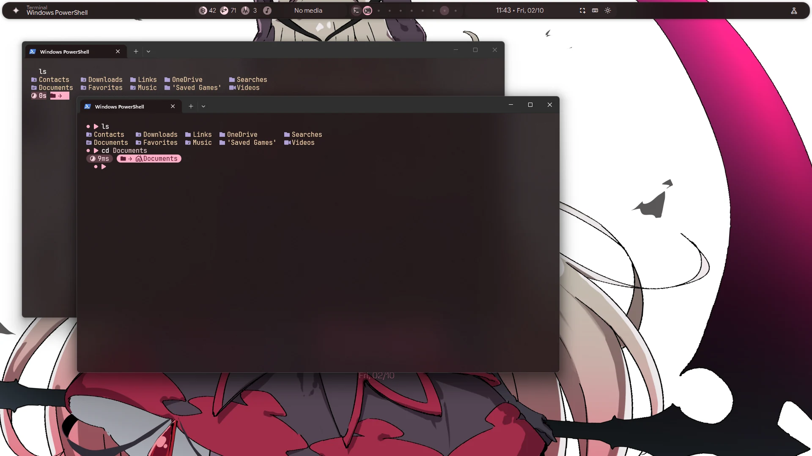
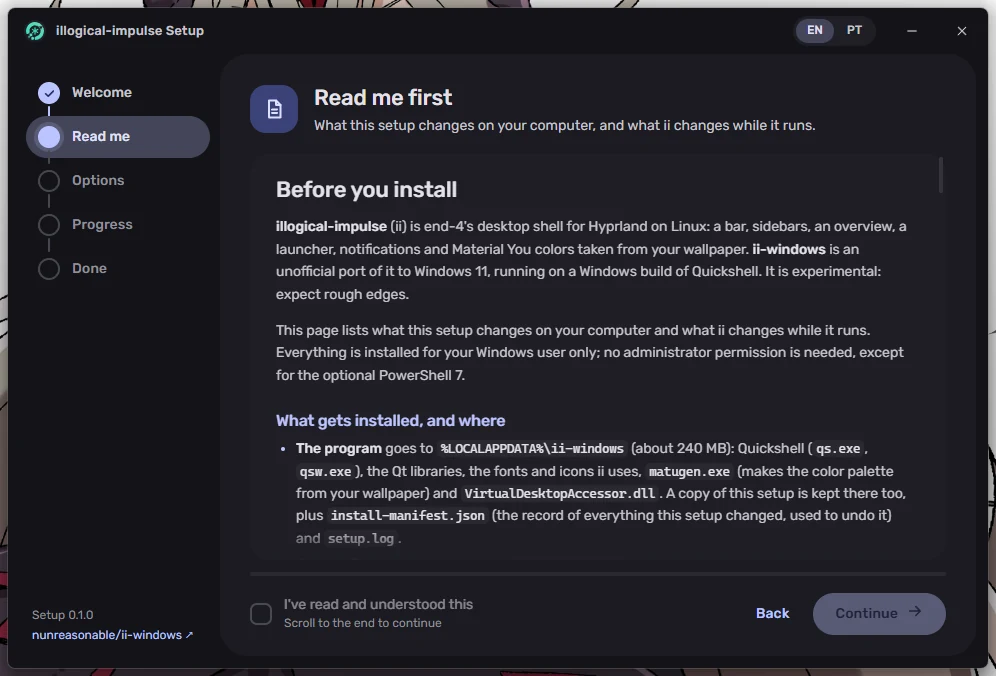

    <picture>
        <source media="(prefers-color-scheme: dark)" srcset="assets/illogical-impulse-for-windows-transparent.png">
        
    </picture>
    <h3>【 end_4's illogical-impulse, ported to Windows 10 and 11 】</h3>

    <h2>• overview •</h2>
    <h3></h3>

> [!WARNING]
> This is an **unofficial** port. It isn't made or supported by end-4 or by the Quickshell
> developers, so please don't take Windows problems to their repos: open an issue here instead.
> It is experimental, expect rough edges.

  
What this is/isn't

  - [illogical-impulse](https://github.com/end-4/dots-hyprland) (ii), end-4's Quickshell desktop shell for Hyprland, running natively on Windows 10 and 11
  - Bar with the system tray, sidebars, a Spotlight-style search, notifications, cheatsheet (with a System tab for CPU, GPU, memory and disks), settings app, screen recording, translation and Material You colors from your wallpaper, the same QML as on Linux wherever it could stay the same
  - Two looks to pick from, with the same features and options: ii's original style or the one from pctrade's [end4-pC](https://github.com/pctrade/end4-pC) fork (its settings card, workspace numbers, a color picker on the bar)
  - It lives next to Explorer: the Windows taskbar is still there (hidden until you touch the screen edge it sits on), and ii's widgets (clock, weather, CPU/RAM/disk) sit on the Windows desktop next to your icons, over the Windows wallpaper, which ii keeps the same as the one you pick
  - NOT a Windows replacement: windows are still Windows' own and ii's workspaces are Windows' virtual desktops. Optional tiling (Hyprland's dwindle, off by default) works on top of them, with no extra window manager to install

  
How the port works

  - **Quickshell for Windows**: a fork of Quickshell with a Windows backend. Panels are AppBars, input masks come from a low-level mouse hook, global shortcuts from `RegisterHotKey` plus a keyboard hook (for the lone Windows key), and the `Quickshell.Hyprland` module is backed by a window tracker and Windows' virtual desktops
  - **Tiling**: an optional dwindle layout in the Windows backend, one per virtual desktop and monitor, driven by the same dispatchers ii's keybinds already use (`togglefloating`, `togglesplit`, `movewindow`, `splitratio`...)
  - **Native services**: audio on Core Audio, media on WinRT media controls, notifications from Windows' own toasts, the system tray shared with Explorer's, screen recording on Windows.Graphics.Capture and Media Foundation, the media visualizer on a WASAPI loopback, clipboard history, Wi-Fi on WlanAPI, Bluetooth on WinRT, OCR on `Windows.Media.Ocr`, night light and software brightness as a gamma ramp, and so on, behind the same QML APIs ii already uses
  - **Helpers**: [SongRec](https://github.com/marin-m/SongRec)'s recognizer for music recognition and [MicroTeX](https://github.com/NanoMichael/MicroTeX) for LaTeX in the AI chat, both built for Windows
  - **ii for Windows**: a fork of ii where the services keep their public properties and swap only the implementation, so most modules are untouched
  - **Colors**: `matugen.exe` with ii's own template, so the palette from a wallpaper is the same as on Linux. Windows' wallpaper and light/dark mode follow what you pick in ii, and its accent color follows the palette
  - Quickshell (based on upstream 0.3.1), matugen, the helpers and the setup are cross-compiled from Linux (clang-cl + xwin, Qt 6.11) and tested in a Windows 11 VM (with and without a passed-through GPU) and a Windows 10 22H2 VM

  
Installation

  - Download **`ii-windows-setup.exe`** from the [latest release](https://github.com/nunreasonable/ii-windows/releases/latest) and run it
    - It shows a README with everything it changes on your PC, and you have to read it before installing
    - It lets you pick the look (ii's original or end4-pC), with a picture of each; you can switch later in *Settings → Quick → Style*
    - Everything goes into your Windows user, no administrator needed (except the optional PowerShell 7)
    - It downloads the package from the release and checks its SHA-256 before installing anything
  - Update, repair and uninstall are in the same setup: *Settings → Apps → Installed apps → illogical-impulse (ii-windows) → Modify*
  - The setup isn't signed yet, so SmartScreen may complain: *More info → Run anyway*
  - **Keybinds**: the same as on Linux where Windows allows it. Important ones:
    - `Win`+`/` = keybind list
    - `Win` alone = Spotlight search: apps, files, clipboard, emoji, system actions and the web (Settings → Services → Search switches back to ii's original overview)
    - `Win`+`Tab` = workspaces and their windows
    - `Win`+`Enter` = terminal
    - `Win`+drag = move a window, `Win`+right drag = resize it (like `bindm` on Hyprland)
  - Needs Windows 10 version 2004 or newer (22H2 recommended) or Windows 11 (build 22000 or
    newer). winget is needed for the optional terminal tools and FFmpeg; on Windows 10 without it, the setup can install it
  - Every time it opens, the setup checks GitHub for a newer release and updates itself first

  
What works

  - **Tested on Windows 11 25H2** (in the VMs): bar, system tray, sidebars, launcher and search, cheatsheet, settings app, notifications (including the ones other apps show), clipboard history, screen snip and OCR, screen recording, translation, LaTeX rendering, wallpaper selector and Material colors, the wallpaper behind the desktop icons, virtual desktops as workspaces, taskbar on hover, terminal theming, weather, the media visualizer, the color picker, the Spotlight search, the cheatsheet's System tab, and the setup (install, update, self-update, repair, uninstall)
  - **Tested on Windows 10 22H2** (in a VM): the shell, virtual desktops, tiling, taskbar on hover, blur, the system tray (icons from apps started before ii included), the wallpaper behind the desktop icons with draggable widgets, the screen translator, the classic console's prompt and colors, software brightness, `Win`+drag to move and resize windows (also across monitors with different scaling, with and without tiling), the bar at 125% and 150% scaling and after changing the scale while ii runs, and the setup with Windows Terminal, the terminal tools and FFmpeg
  - **Settings app**: almost every option is there now, not only in `config.json`, in two layouts (ii's and end4-pC's) with exactly the same options
  - **Startup**: on a VM held to two slow cores at 40% and a disk at 120 IOPS, the bar shows in about 1.6 seconds (about 43 in 0.5.0)
  - **Also tested on real hardware**: an Intel i3-13100 with its integrated GPU only, on Windows 11
  - **Tested on real hardware**: Wi-Fi and Bluetooth
  - **Built on Windows' own APIs but barely tested**: audio, media controls, battery, laptop brightness and music recognition (the VMs have no battery or laptop screen, and no song was played to recognize), game mode, the Cloudflare WARP toggle (needs Cloudflare's WARP client) and the warning before shutting down while winget is installing
  - **Not on Windows**: ii's lock screen (`Win`+`L` uses Windows' own, which is the right one there) and the EasyEffects toggle
  - **Known limit**: while a window of an app running as administrator (Task Manager, installers) has the focus, Windows doesn't let ii see the keyboard, so ii's shortcuts don't work there and `Win`+`Q` opens Windows' search instead. Close those windows with `Alt`+`F4` or a middle click in the overview

  
Software overview

  | Software | Purpose |
  | ------------- | ------------- |
  | [Quickshell for Windows](https://github.com/nunreasonable/quickshell/tree/windows) | The widget system, with a native Windows backend |
  | [ii for Windows](https://github.com/nunreasonable/dots-hyprland/tree/ii-windows) | The shell itself: bar, sidebars, settings and the rest |
  | [matugen](https://github.com/InioX/matugen) | Material You palette from the wallpaper |
  | [VirtualDesktopAccessor](https://github.com/Ciantic/VirtualDesktopAccessor) | Switching and creating Windows virtual desktops |
  | [SongRec](https://github.com/marin-m/SongRec) | Music recognition (its recognizer, built for Windows) |
  | [MicroTeX](https://github.com/NanoMichael/MicroTeX) | LaTeX formulas in the AI chat |
  | [FFmpeg](https://ffmpeg.org) | Optional, installed by the setup with winget if you want it |
  | [Oh My Posh](https://ohmyposh.dev), [Starship](https://starship.rs), [eza](https://github.com/eza-community/eza) | Optional terminal look, installed by the setup with winget |
  | [Tauri](https://tauri.app) | The setup's window |

    <h2>• screenshots •</h2>
    <h3></h3>

| Sidebar, colors from the Windows wallpaper | Cheatsheet (`Win`+`/`) |
|:---|:---------------|
|  |  |
| **Windows Terminal in ii's colors** | **The setup** |
|  |  |

    <h2>• credits •</h2>
    <h3></h3>

All of the design and nearly all of the shell are other people's work. This repo only makes it run on Windows.

 - [@end-4](https://github.com/end-4) for illogical-impulse and [dots-hyprland](https://github.com/end-4/dots-hyprland): every widget here is theirs. If you like it, [support them](https://github.com/sponsors/end-4) and give the original a star
 - Everyone thanked in [dots-hyprland's README](https://github.com/end-4/dots-hyprland#readme), including [@clsty](https://github.com/clsty) and [@midn8hustlr](https://github.com/midn8hustlr), and all of [dots-hyprland's contributors](https://github.com/end-4/dots-hyprland/graphs/contributors)
 - [@pctrade](https://github.com/pctrade) for [end4-pC](https://github.com/pctrade/end4-pC), the fork of ii whose look and settings window are the second visual style here
 - [@outfoxxed](https://github.com/outfoxxed) and the contributors of [Quickshell](https://quickshell.outfoxxed.me), the toolkit underneath it all
 - [minimal-05/quickshell-macos](https://github.com/minimal-05/quickshell-macos), whose macOS port of Quickshell and ii showed this could be done
 - [InioX](https://github.com/InioX) for [matugen](https://github.com/InioX/matugen), [Ciantic](https://github.com/Ciantic) for [VirtualDesktopAccessor](https://github.com/Ciantic/VirtualDesktopAccessor), and Google's [material-color-utilities](https://github.com/material-foundation/material-color-utilities), ported for the terminal colors
 - [marin-m](https://github.com/marin-m) for [SongRec](https://github.com/marin-m/SongRec) and [NanoMichael](https://github.com/NanoMichael) for [MicroTeX](https://github.com/NanoMichael/MicroTeX)
 - [RetroBar](https://github.com/dremin/RetroBar) and [ManagedShell](https://github.com/cairoshell/ManagedShell), whose way of sharing the tray with Explorer the Windows tray follows
 - The Qt Project, and the fonts and icons ii ships with: JetBrains Mono and Nerd Fonts, Readex Pro, Space Grotesk, Google Sans Flex, Material Symbols and GNOME's Adwaita icons (the setup itself uses Rubik)

    <h2>• license •</h2>
    <h3></h3>

- This repo (the setup and the packaging scripts) is GPL-3.0, like ii. See [LICENSE](LICENSE)
- The forks keep their upstream licenses: Quickshell for Windows is LGPL-3.0 and ii for Windows is GPL-3.0
- The release package also includes Qt (LGPL-3.0), matugen (GPL-2.0), VirtualDesktopAccessor (MIT), SongRec's recognizer (GPL-3.0-or-later, source in [tools/songrec](tools/songrec)), MicroTeX (MIT, build in [tools/microtex](tools/microtex)), the Visual C++ runtime and fonts under the SIL Open Font License and Apache-2.0. The setup's README lists them all
- Copying: go ahead, just follow the licenses, like upstream asks
